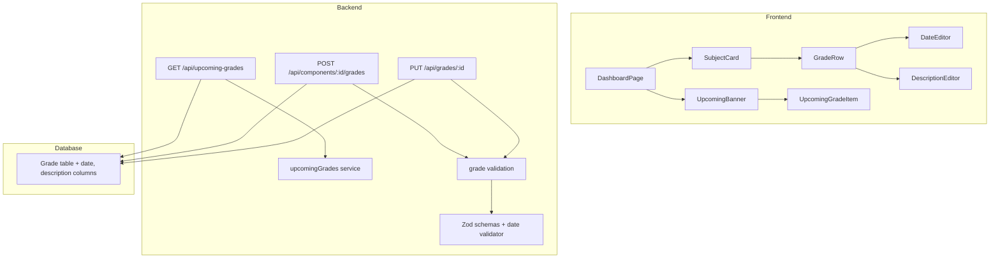

# Design Document: Grade Dates and Upcoming Banner

## Overview

Esta funcionalidad extiende el modelo `Grade` con dos campos opcionales (`date` y `description`) y agrega un componente visual `UpcomingBanner` al dashboard que muestra las evaluaciones próximas codificadas por color según urgencia.

**Cambios principales:**
1. Migración de base de datos: agregar campos `date` (Date, nullable) y `description` (String, nullable) al modelo Grade
2. Actualización de la API: modificar endpoints de creación/actualización de grades para soportar los nuevos campos, y crear un nuevo endpoint GET `/api/upcoming-grades`
3. Nuevo componente frontend `UpcomingBanner` en la parte superior del dashboard
4. Actualización de `GradeRow` para soportar edición inline de fecha y descripción
5. Extensión del sistema de i18n con traducciones para los nuevos campos

## Architecture



**Flujo de datos:**
1. El usuario crea/edita una grade con fecha y/o descripción opcionales
2. El backend valida los campos con Zod (fecha ISO 8601, descripción max 500 chars con trim)
3. Prisma persiste los datos en PostgreSQL
4. El endpoint `/api/upcoming-grades` filtra grades con fecha entre hoy y hoy+30 días
5. El frontend consume el endpoint y renderiza el banner con color-coding

## Components and Interfaces

### Backend

#### Prisma Schema Changes

```prisma
model Grade {
  id                 String           @id @default(uuid())
  subjectComponentId String
  name               String
  value              Float?
  weightPercentage   Float
  order              Int
  date               DateTime?        @db.Date
  description        String?          @db.VarChar(500)
  subjectComponent   SubjectComponent @relation(fields: [subjectComponentId], references: [id], onDelete: Cascade)
}
```

#### Updated Zod Schemas

```typescript
// validators/schemas.ts

const isoDateRegex = /^\d{4}-\d{2}-\d{2}$/;

const gradeDateSchema = z.string()
  .regex(isoDateRegex, 'Invalid date format, expected YYYY-MM-DD')
  .refine((val) => {
    const d = new Date(val + 'T00:00:00Z');
    return !isNaN(d.getTime()) && d.toISOString().startsWith(val);
  }, 'Date does not represent a valid calendar date');

const gradeDescriptionSchema = z.string()
  .transform((val) => val.trim())
  .pipe(
    z.string().max(500, 'Description exceeds 500 character limit')
  )
  .transform((val) => val === '' ? null : val);

export const createGradeSchema = z.object({
  name: z.string().min(1).max(100),
  value: z.number().min(1.0).max(7.0).nullable().optional(),
  weightPercentage: z.number().min(1).max(100),
  date: gradeDateSchema.nullable().optional(),
  description: gradeDescriptionSchema.nullable().optional(),
});

export const updateGradeSchema = z.object({
  name: z.string().min(1).max(100).optional(),
  value: z.number().min(1.0).max(7.0).nullable().optional(),
  weightPercentage: z.number().min(1).max(100).optional(),
  date: gradeDateSchema.nullable().optional(),
  description: gradeDescriptionSchema.nullable().optional(),
});
```

#### New Endpoint: GET /api/upcoming-grades

```typescript
// routes/grades.ts - new route

interface UpcomingGradeResponse {
  id: string;
  name: string;
  date: string;              // ISO date string YYYY-MM-DD
  description: string | null;
  subjectComponentName: string;
  subjectName: string;
}

// GET /api/upcoming-grades
// Returns grades with date between today (00:00:00) and today+30 days (inclusive)
// Sorted by date ascending
// Only grades belonging to the authenticated user
```

### Frontend

#### UpcomingBanner Component

```typescript
interface UpcomingGrade {
  id: string;
  name: string;
  date: string;
  description: string | null;
  subjectComponentName: string;
  subjectName: string;
}

interface UpcomingBannerProps {
  grades: UpcomingGrade[];
  locale: 'es' | 'en';
}

// Color classification pure function
type UrgencyColor = 'red' | 'yellow' | 'green';

function getUrgencyColor(daysRemaining: number): UrgencyColor {
  if (daysRemaining <= 7) return 'red';
  if (daysRemaining <= 14) return 'yellow';
  return 'green';
}

// Days remaining calculation (pure function)
function getDaysRemaining(gradeDate: string, today: string): number {
  const target = new Date(gradeDate + 'T00:00:00');
  const current = new Date(today + 'T00:00:00');
  return Math.ceil((target.getTime() - current.getTime()) / (1000 * 60 * 60 * 24));
}
```

#### Updated GradeRow Component

Se extiende `GradeRow` con dos nuevos campos de edición inline:
- **Date column**: Muestra la fecha formateada o un ícono de calendario (opacidad reducida si es null). Click activa `<input type="date">`.
- **Description indicator**: Ícono de nota junto a la fila. Click abre un `<textarea>` con max 500 caracteres.

Ambos campos siguen el patrón existente: Enter/blur para guardar, Escape para cancelar.

#### Updated Shared Types

```typescript
// packages/shared/src/types.ts
export interface Grade {
  id: string;
  subjectComponentId: string;
  name: string;
  value: number | null;
  weightPercentage: number;
  order: number;
  date: string | null;         // ISO date string or null
  description: string | null;  // text or null
}
```

#### Date Formatting Utility

```typescript
// utils/dateFormat.ts
function formatGradeDate(isoDate: string, locale: 'es' | 'en'): string {
  const date = new Date(isoDate + 'T00:00:00');
  return date.toLocaleDateString(locale === 'es' ? 'es-CL' : 'en-US', {
    day: 'numeric',
    month: 'numeric',
    year: 'numeric',
  });
}
```

## Data Models

### Database Changes

| Campo | Tipo | Nullable | Default | Descripción |
|-------|------|----------|---------|-------------|
| `date` | DATE | Sí | NULL | Fecha de la evaluación (sin hora) |
| `description` | VARCHAR(500) | Sí | NULL | Descripción de contenidos de la evaluación |

### API Contracts

**POST /api/components/:componentId/grades** (updated)
```json
{
  "name": "Solemne 1",
  "value": 5.5,
  "weightPercentage": 30,
  "date": "2025-03-15",       // optional
  "description": "Capítulos 1-4" // optional
}
```

**PUT /api/grades/:id** (updated)
- Enviar `"date": "2025-03-15"` → actualiza la fecha
- Enviar `"date": null` → elimina la fecha
- Omitir el campo `date` → preserva el valor actual
- Enviar `"description": ""` o `"description": null` → elimina la descripción
- Enviar `"description": "texto"` → actualiza la descripción

**GET /api/upcoming-grades** (new)
```json
{
  "success": true,
  "data": [
    {
      "id": "uuid",
      "name": "Solemne 1",
      "date": "2025-03-15",
      "description": "Capítulos 1-4",
      "subjectComponentName": "Cátedra",
      "subjectName": "Cálculo I"
    }
  ]
}
```

### i18n Keys (new)

```typescript
// Added to translations structure
{
  upcomingBanner: {
    title: string;           // "Evaluaciones próximas" / "Upcoming evaluations"
    daysRemaining: string;   // "en {n} días" / "in {n} days"
    today: string;           // "Hoy" / "Today"
    tomorrow: string;        // "Mañana" / "Tomorrow"
  },
  grade: {
    // existing keys...
    dateLabel: string;       // "Fecha" / "Date"
    datePlaceholder: string; // "Sin fecha" / "No date"
    descriptionLabel: string;      // "Descripción" / "Description"
    descriptionPlaceholder: string; // "Agregar descripción..." / "Add description..."
    invalidDate: string;           // "Formato de fecha inválido" / "Invalid date format"
    descriptionTooLong: string;    // "La descripción excede 500 caracteres" / "Description exceeds 500 characters"
  }
}
```

## Correctness Properties

*A property is a characteristic or behavior that should hold true across all valid executions of a system — essentially, a formal statement about what the system should do. Properties serve as the bridge between human-readable specifications and machine-verifiable correctness guarantees.*

### Property 1: Date validation round-trip

*For any* string that matches the ISO 8601 format (YYYY-MM-DD) and represents a valid calendar date, the date validation function SHALL accept it. *For any* string that does NOT match the format or does NOT represent a valid calendar date (e.g., 2024-02-30, 2024-13-01), the validation SHALL reject it.

**Validates: Requirements 1.4, 1.5**

### Property 2: Grade update date semantics

*For any* existing grade with any current date value (null or non-null), when an update payload provides an explicit date value, the grade's date SHALL equal that value; when the payload sends date as null, the grade's date SHALL become null; when the payload omits the date field entirely, the grade's date SHALL remain unchanged from its previous value.

**Validates: Requirements 1.3**

### Property 3: Description normalization

*For any* string input for description, after applying trim: if the resulting string is empty or contains only whitespace, the stored value SHALL be null; if the resulting string length is ≤ 500 characters, the stored value SHALL equal the trimmed string; if the resulting string length is > 500 characters, the operation SHALL be rejected.

**Validates: Requirements 2.3, 2.4, 2.5, 2.6**

### Property 4: Upcoming grades date range filter

*For any* set of grades with various dates (null, past, today, within 30 days, beyond 30 days), the upcoming grades endpoint SHALL return exactly those grades whose date is ≥ start of today AND ≤ today + 30 days. Grades with null date or past dates SHALL be excluded.

**Validates: Requirements 3.1, 3.4**

### Property 5: Upcoming grades sort order

*For any* result set returned by the upcoming grades endpoint, the grades SHALL be sorted by date in ascending order — that is, for every consecutive pair of items (i, i+1), item[i].date ≤ item[i+1].date.

**Validates: Requirements 3.3**

### Property 6: Upcoming grades user isolation

*For any* authenticated user, the upcoming grades endpoint SHALL return only grades that belong to that user through the ownership chain (Grade → SubjectComponent → Subject → Period → User). No grade belonging to another user SHALL appear in the results.

**Validates: Requirements 3.7**

### Property 7: Urgency color classification

*For any* integer representing days remaining in the range [0, 30], the color classification function SHALL return: "red" for values 0-7, "yellow" for values 8-14, and "green" for values 15-30. The ranges SHALL be exhaustive and non-overlapping.

**Validates: Requirements 4.2**

### Property 8: Date formatting by locale

*For any* valid ISO date string and locale ("es" or "en"), the date formatting function SHALL produce a string that matches the regional short date format — day/month/year for "es" locale, and month/day/year for "en" locale.

**Validates: Requirements 6.3**

### Property 9: Banner display limit

*For any* set of upcoming grades with more than 10 items, the banner SHALL display at most 10 evaluations, and those 10 SHALL be the first 10 by ascending date order (the most imminent ones).

**Validates: Requirements 4.1**

## Error Handling

### Backend Errors

| Escenario | HTTP Status | Mensaje |
|-----------|------------|---------|
| Fecha con formato inválido | 400 | "Invalid date format, expected YYYY-MM-DD" |
| Fecha no representa día real | 400 | "Date does not represent a valid calendar date" |
| Descripción > 500 chars | 400 | "Description exceeds 500 character limit" |
| Componente no encontrado | 404 | "Component not found" |
| Grade no encontrada | 404 | "Grade not found" |
| No autenticado | 401 | "Authentication required" |
| Error interno | 500 | "Internal server error" |

### Frontend Error Handling

- Los errores de validación del backend se muestran via `react-hot-toast` con el mensaje de error traducido
- Si el endpoint de upcoming grades falla, el banner no se muestra (fail silently sin romper el dashboard)
- Los inputs de fecha/descripción revert al valor previo si el save falla

## Testing Strategy

### Property-Based Tests (fast-check + vitest)

El proyecto ya utiliza `fast-check` en ambos paquetes (backend y frontend). Los property tests validarán las propiedades definidas arriba.

**Backend (packages/backend):**
- Property 1: Validación de fecha ISO 8601 con generadores de strings válidos e inválidos
- Property 2: Semántica de update de fecha (set/clear/preserve)
- Property 3: Normalización de descripción (trim + whitespace → null + length limit)
- Property 4: Filtrado por rango de fechas del endpoint upcoming
- Property 5: Ordenamiento ascendente por fecha
- Property 6: Aislamiento por usuario

**Frontend (packages/frontend):**
- Property 7: Clasificación de color por urgencia
- Property 8: Formateo de fecha por locale
- Property 9: Límite de 10 items en el banner

**Configuración:**
- Mínimo 100 iteraciones por property test
- Cada test referencia su propiedad del documento de diseño
- Tag format: **Feature: grade-dates-and-upcoming-banner, Property {number}: {property_text}**

### Unit Tests (ejemplo-based)

- Renderizado del banner con 0 evaluaciones (no se muestra)
- Renderizado del banner con datos (verifica estructura DOM)
- Atributos de accesibilidad (role="region", aria-label)
- Edición inline de fecha en GradeRow (click, Enter, Escape, blur)
- Edición inline de descripción en GradeRow
- Existencia de todas las claves i18n en ambos locales
- Endpoint upcoming-grades sin autenticación (401)
- Endpoint upcoming-grades con resultado vacío

### Integration Tests

- Flujo completo: crear grade con fecha → consultar upcoming → verificar que aparece
- Flujo de update: editar fecha → verificar persistencia
- Flujo de delete fecha: enviar null → verificar eliminación
